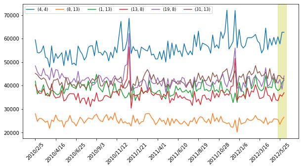

## 時系列予測

### データ

学習: [data/walmart_ts_6_fcst_grp_train.csv](./data/walmart_ts_6_fcst_grp_train.csv)  
テスト: [data/walmart_ts_6_fcst_grp_test.csv](./data/walmart_ts_6_fcst_grp_test.csv)  

※ 黄色の影付き部分がテスト期間  

### アプローチ

1) Driverless AIで説明変数を含めデフォルト設定で実施
  - 結果: [DAI_results/default/](DAI_results/default/)
2) Driverless AIで説明変数なしでデフォルト設定で実施
  - 結果: [DAI_results/no_covariate/](DAI_results/no_covariate/)
3) Chronos BoltでZero Shot予測
  - 結果: [Chronos_results/ChronosBolt_0shot.csv](Chronos_results/ChronosBolt_0shot.csv)
4) Chronos BoltでFine Tuning
  - 結果: [Chronos_results/ChronosBolt_FT.csv](Chronos_results/ChronosBolt_FT.csv)
5) Chronos Boltで説明変数を含めてZero Shot予測
  - 結果: [Chronos_results/ChronosBolt_0Shot_Covariate.csv](Chronos_results/ChronosBolt_0Shot_Covariate.csv)
6) Chronos Boltで説明変数を含めてFine Tuning
  - 結果: [Chronos_results/ChronosBolt_FT_Covariate.csv](Chronos_results/ChronosBolt_FT_Covariate.csv)

Driverless AI: https://docs.h2o.ai/driverless-ai/1-11-lts/docs/userguide/index.html  
Chronos Bolt: https://github.com/amazon-science/chronos-forecasting, https://auto.gluon.ai/stable/tutorials/timeseries/forecasting-chronos.html  

説明変数リスト: ['MarkDown1', 'MarkDown2', 'MarkDown3', 'MarkDown4', 'MarkDown5', 'IsHoliday']

### 結果
[results.xlsx](./results.xlsx)
