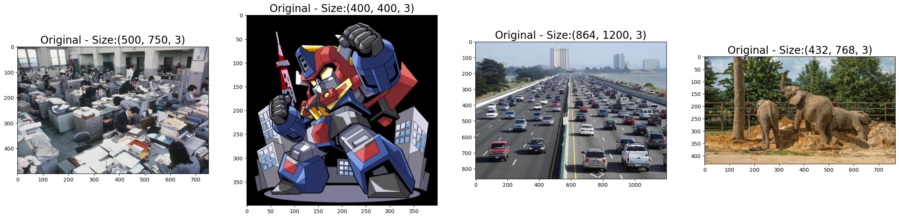
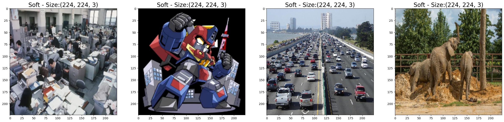
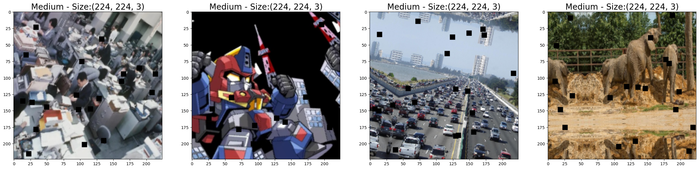
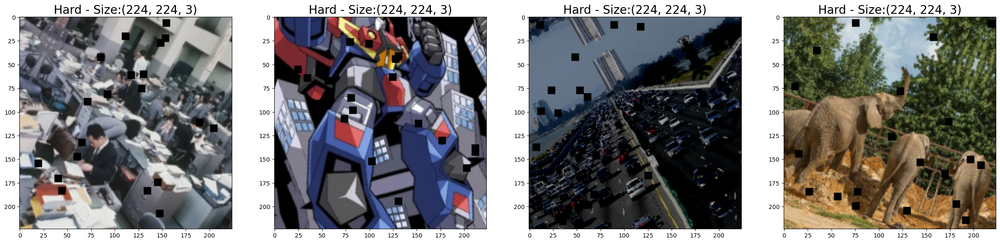

# データ拡張

***
[Albumentations documentation](https://albumentations.ai/docs/)

***

## Hydrogen Torch データ拡張

HT Document: [Augmentation settings](https://docs.h2o.ai/h2o-hydrogen-torch/guide/experiments/experiment-settings/image-regression#augmentation-settings)

  
 - Augmentations Strategy
     - Soft: Resize & HorizontalFlip
     - Medium: Soft strategy + ShiftScaleRotate & CoarseDropout
     - Hard: Medium strategy（Resizeの代わりにRandomResizedCrop) + RandomBrightnessContrast 
 - Mix Image
     - Disabled: 適用なし
     - Mixup: 2つの画像を重ねる手法
     - Cutmix: 画像をパッチで別の画像で埋める手法
  
### Soft/Medium/Hard Strategy  
[HT_augmentation.ipynb](./HT_augmentation.ipynb)

