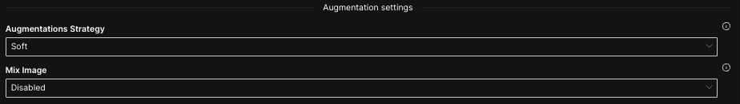

## Hydrogen Torch データ拡張

  
Augmentations Strategy
 - Soft: Resize & HorizontalFlip
 - Medium: Soft strategy + ShiftScaleRotate & CoarseDropout
 - Hard: Medium strategy（Resizeの代わりにRandomResizedCrop) + RandomBrightnessContrast 
  
Mix Image
 - Disabled: 適用なし
 - Mixup: 2つの画像を重ねる手法
 - Cutmix: 画像をパッチで別の画像で埋める手法

Document: [Augmentation settings](https://docs.h2o.ai/h2o-hydrogen-torch/guide/experiments/experiment-settings/image-regression#augmentation-settings)

