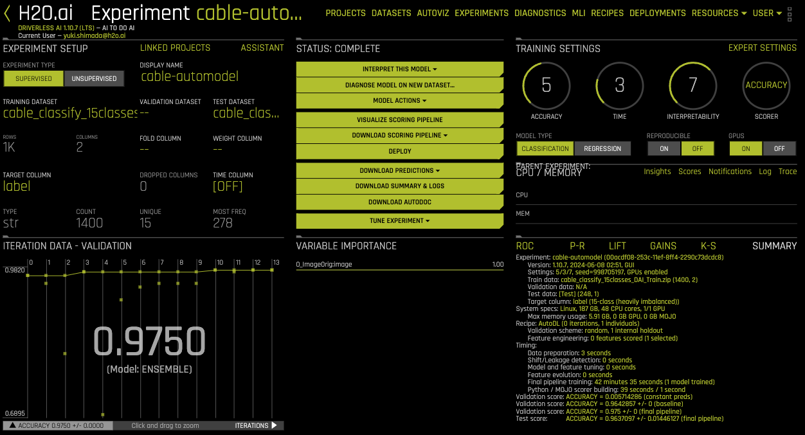
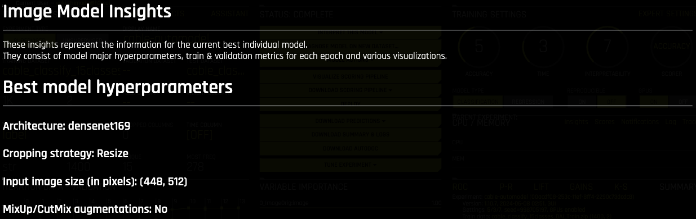
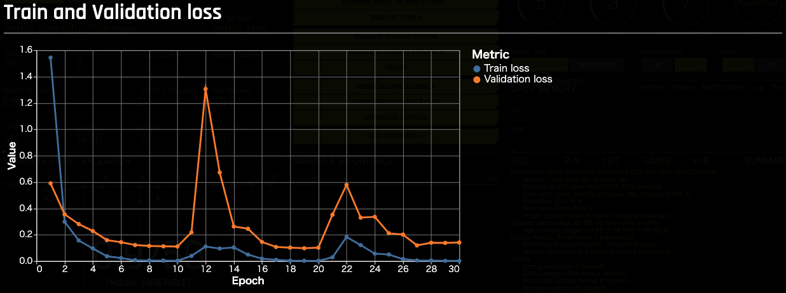
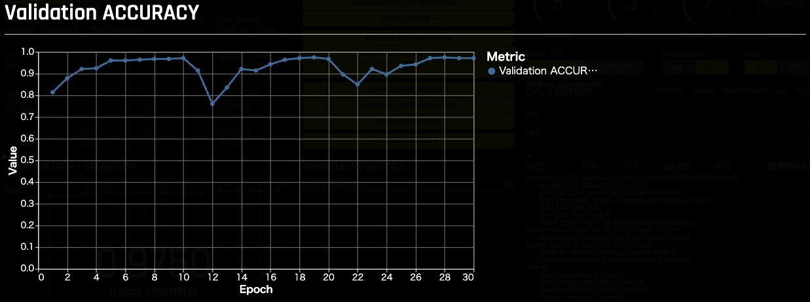
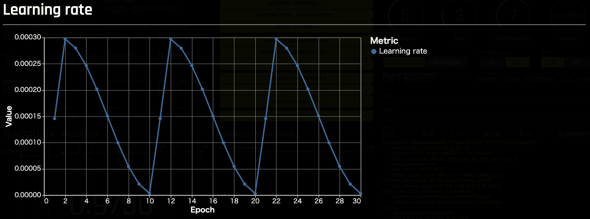
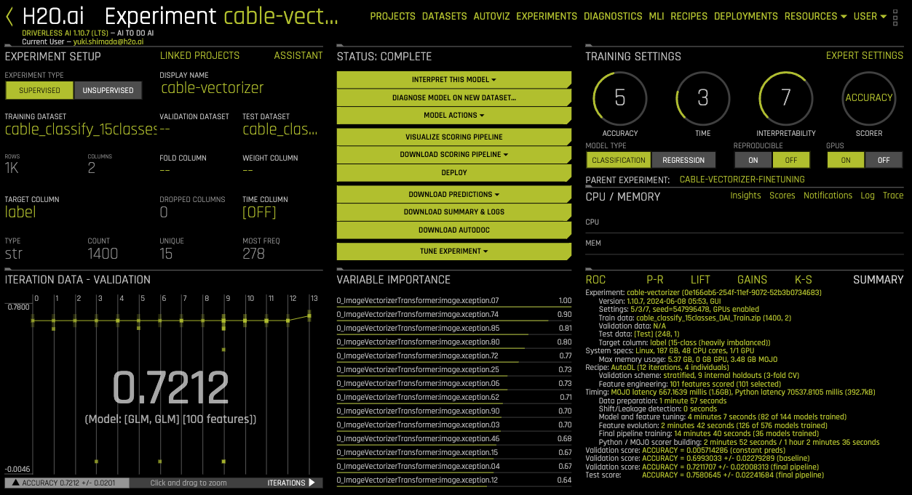
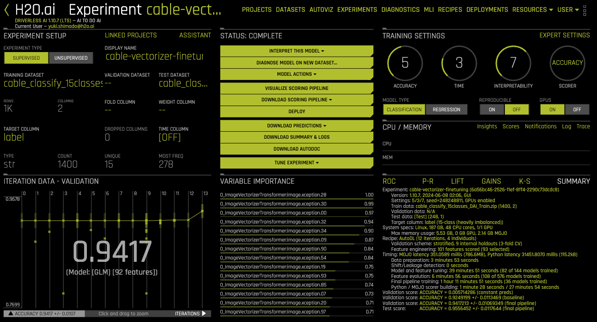

## Driverless AI
Document:
- [Image Processing in Driverless AI](https://docs.h2o.ai/driverless-ai/1-10-lts/docs/userguide/image-processing.html)

Dataset: 
 - (Train) https://sample-data-open.s3.ap-northeast-1.amazonaws.com/cable_classification_15classes/cable_classify_15classes_DAI_Train.zip
- (Test) https://sample-data-open.s3.ap-northeast-1.amazonaws.com/cable_classification_15classes/cable_classify_15classes_DAI_Test.zip

***
### 結果
結果： [Results_DAI.xlsx](./Results_DAI.xlsx)
| Metric     | Auto Model - Test Data Score | Vectorizer (特徴量抽出器) - Validation Data Score | Vectorizer (特徴量抽出器) - Test Data Score | Vectorizer (Fine Tuning) - Validation Data Score | Vectorizer (Fine Tuning) - Test Data Score |
|------------|-------------|--------------------------------------------------|-------------------------------------------|------------------------------------------------|-----------------------------------------|
| ACCURACY   | 0.9637097   | 0.7211707                                       | 0.7580645                                 | 0.9417213                                      | 0.9556452                               |
| AUC        | 0.9994077   | 0.9696441                                       | 0.9750492                                 | 0.9972223                                      | 0.9996284                               |
| AUCPR      | 0.993736    | 0.8005545                                       | 0.8248772                                 | 0.9801101                                      | 0.9954494                               |
| F05        | 0.9637097   | 0.7211707                                       | 0.7580645                                 | 0.9417213                                      | 0.9556452                               |
| F1         | 0.9637097   | 0.7211707                                       | 0.7580645                                 | 0.9417213                                      | 0.9556452                               |
| F2         | 0.9637097   | 0.7211707                                       | 0.7580645                                 | 0.9417213                                      | 0.9556452                               |
| FDR        | 0.02459016  | 0.2740434                                       | 0.2379032                                 | 0.04550694                                     | 0.004273504                             |
| FNR        | 0.04032258  | 0.2602273                                       | 0.2379032                                 | 0.05795018                                     | 0.06048387                              |
| FOR        | 0.00287687  | 0.0186005                                       | 0.016993                                  | 0.004132935                                    | 0.004302926                             |
| FPR        | 0.001728111 | 0.0204779                                       | 0.016993                                  | 0.003245118                                    | 0.000288018                             |
| GINI       | 0.9983208   | 0.8962308                                       | 0.8299833                                 | 0.9875413                                      | 0.9973238                               |
| LOGLOSS    | 0.1359895   | 1.094053                                        | 0.9030471                                 | 0.2136661                                      | 0.1083456                               |
| MACROAUC   | 0.9991604   | 0.9481154                                       | 0.9149916                                 | 0.9937706                                      | 0.9986619                               |
| MACROF1    | 0.8416411   | 0.5825501                                       | 0.6130697                                 | 0.8035155                                      | 0.8357185                               |
| MACROMCC   | 0.8385362   | 0.5639636                                       | 0.5952642                                 | 0.8003718                                      | 0.8318972                               |
| MCC        | 0.9611175   | 0.7012543                                       | 0.7407834                                 | 0.9375585                                      | 0.952477                                |
| NPV        | 0.9971231   | 0.9813995                                       | 0.9830069                                 | 0.9958671                                      | 0.9956971                               |
| PRECISION  | 0.9754098   | 0.7259566                                       | 0.7620968                                 | 0.9544931                                      | 0.9957265                               |
| RECALL     | 0.9596774   | 0.7397727                                       | 0.7620968                                 | 0.9420498                                      | 0.9395161                               |
| TNR        | 0.9982719   | 0.9795221                                       | 0.9830069                                 | 0.9967549                                      | 0.999712                                |

  
***
### Auto Image Model

***
### Image Vectorizer (特徴量抽出器)

***
### Image Vectorizer (Fine Tuning)

