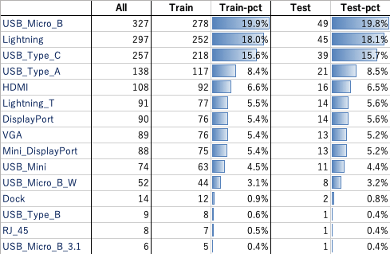

# Multiclass Classification

Original Source: https://competition.nishika.com/competitions/cable/summary
  
ケーブルコネクタ15種の分類
 - 画像サイズ： (H, W, C) = ([31, 1622], [69, 1512], 3)
   - 最小サイズ： (H, W, C) = (31, 69, 3)
   - 最大サイズ: (H, W, C) = (1622, 1512, 3)
 - 学習データ数：1400、テストデータ数:248、合計:1648

  
***

 - Driverless AIによる実施: [DAI dir](./DAI)
 - Hydrogen Torchによる実施: [HT dir](./HT)

***

[EDA](./EDA.ipynb)  
  
  

