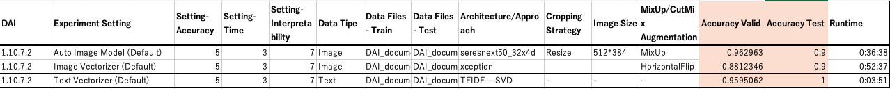

# Driverless AI モデル

### 画像アプローチ
画像データをインプットとしたCNNモデルを作成  

データ
- 学習: https://jp-public.s3.ap-southeast-1.amazonaws.com/data/scan_document_classification_3classes/DAI_document_classification_TRAIN.zip
- テスト: https://jp-public.s3.ap-southeast-1.amazonaws.com/data/scan_document_classification_3classes/DAI_document_classification_TEST.zip

***
### テキストアプローチ
[OCR](../OCR/)で画像から取得したテキストをインプットとしたモデル（TFIDF+SVD）を作成  

データ
- 学習: https://github.com/yukismd/DL_for_ImageData_and_Finetuning/blob/main/classification_document_3classes/OCR/DAI_document_classification_TRAIN_ocr.csv
- テスト: https://github.com/yukismd/DL_for_ImageData_and_Finetuning/blob/main/classification_document_3classes/OCR/DAI_document_classification_TEST_ocr.csv

***
### 結果
  

詳細: [Experiments_DAI.xlsx](./Experiments_DAI.xlsx)
