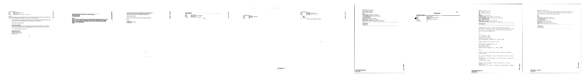
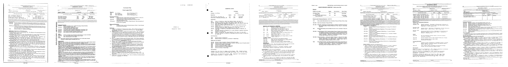
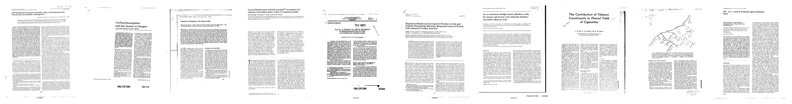

# 文書スキャン画像の分類問題

Data Source: https://github.com/h2oai/ht-catalog/tree/646864e3c695f7c721514159bd6c59520dab7438/Assets/use-cases/document_classification  

- 3カテゴリ(email, resume, scientific_publication)分類
- 合計165枚の画像

| Type                   | All | Train | Test |
|------------------------|-----|-------|------|
| email                 | 55  | 45    | 10   |
| resume                | 55  | 45    | 10   |
| scientific_publication | 55  | 45    | 10   |

**email画像**
  
**resume画像**
  
**scientific_publication画像**
  

※ データDLは各アプローチリンク先  

***
## 実験アプローチ

画像データを用いて画像分類モデルを作成
- 詳細: [DAI](./DAI)
  
CLIPによるZero-SHot分類
- 詳細: [LG_zero-shot](./LG_zero-shot)

Small Vision Language Modelによる分類
- 詳細: [VLM](./VLM)

AI-OCRで画像からテキストを抽出、テキストに対し分類モデルを作成
- OCR詳細: [OCR](./OCR)
- 予測詳細: [DAI](./DAI)

***
## 結果

