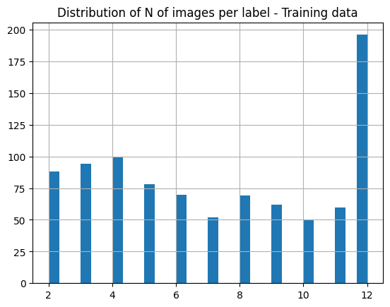
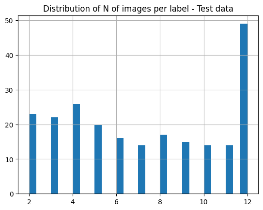

# Metric Learning / 距離学習

### H2O Hydrogen Torchによる画像距離学習（Metric Learning/Similarity Model）

Original Source: H2O Hydrogen Torch - Image Metric Learning sample data
- Original: https://h2o-release.s3.amazonaws.com/hydrogen-torch/1.3.0/bicycle_image_metric_learning.zip  
- Train/Test分割済み: https://jp-public.s3.ap-southeast-1.amazonaws.com/data/image_metric_learning_bicycle/bicycle_image_metric_learning_v2.zip

***
## データ統計
[EDA](./EDA.ipynb)  
  
**データ数**
- Train: 6,650
- Test: 1,663

**ユニークID数（1 IDあたり、何枚の画像があるか）**
- Train: 918 (1 IDあたり、平均で7.24(6650/918)枚の画像)
- Test: 230 (1 IDあたり、平均で7.23(1663/230)枚の画像)

学習データとテストデータ間のID（label）に重複なし。要するにテストデーやのIDは全て新規のクラス  
また、学習データのfold間にもID（label）に重複なし。モデル作成時の検証においても、完全新規のクラスで評価される
  
**画像サイズ**
- Train: [H, W, C] = [[80 ~ 1500], [80 ~ 2894], 3]
- Test: [H, W, C] = [[63 ~ 500], [123 ~ 500], 3]

10枚以上の画像があるIDをもつ画像のサンプル
