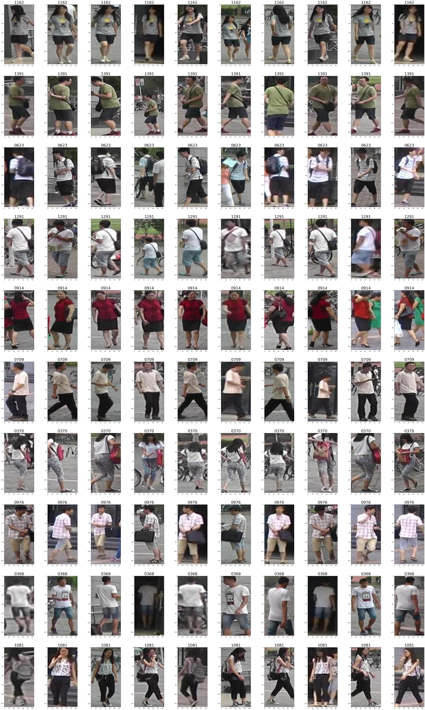

# Metric Learning / 距離学習

Original Source: https://zheng-lab.cecs.anu.edu.au/Project/project_reid.html
  
人物全身画像の距離学習
 - 画像サイズ（同サイズ）： (H, W, C) = (128, 64, 3)
 - データ数
   - Original: [market_metriclearning_small_HT.zip](https://sample-data-open.s3.ap-northeast-1.amazonaws.com/market-metriclearning/market_metriclearning_HT.zip)
     - 学習データ数：12,114、テストデータ数:1,356、合計:13,470
     - 全ラベル数:751、TrainにもTestにもあるラベル数:568、Trainにのみあるラベル数:163、Testのみにあるラベル数:20（568+163+20=751）
   - Small: [market_metriclearning_HT.zip](https://sample-data-open.s3.ap-northeast-1.amazonaws.com/market-metriclearning/market_metriclearning_small_HT.zip)
     - 学習データ数：6,262、テストデータ数:721、合計:6,983
     - 全ラベル数:551、TrainにもTestにもあるラベル数:368、Trainにのみあるラベル数:163、Testのみにあるラベル数:20（368+163+20=551）
  
***

 - Hydrogen Torchによる実施: [HT dir](./HT)
   - 距離学習モデルの作成とチューニング
   - 予測結果データ 
 - PyTorchによる実施: [PT dir](./PT)
   - 学習済みモデルのGlobal Pooling層の出力を検索ベクトルとして利用した場合
   - ArcFace Loss関数を用いたモデル学習
   
***

[Data作成](./make_dataset.ipynb)  
[EDA](./EDA.ipynb)  
  
  

