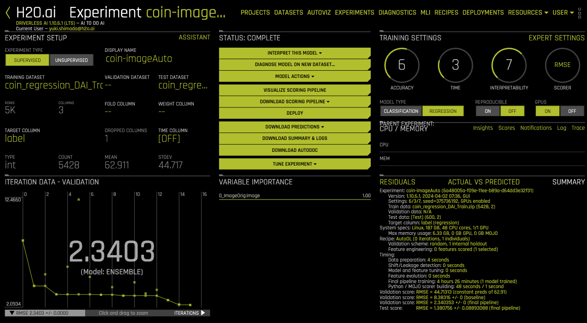
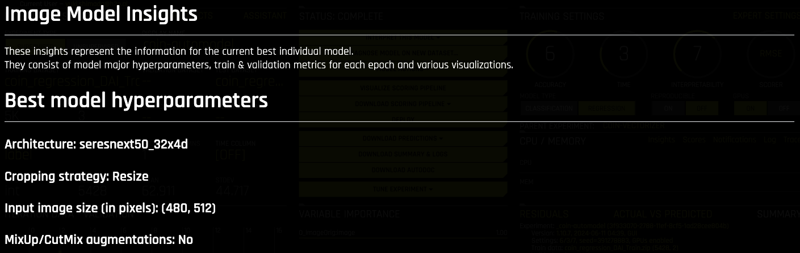
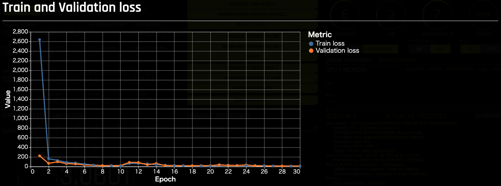
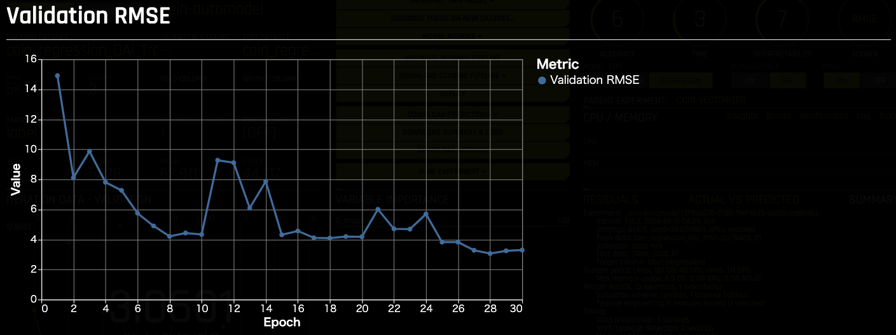
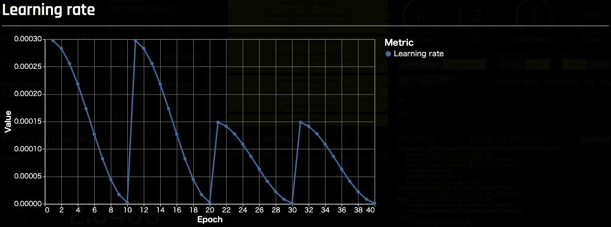
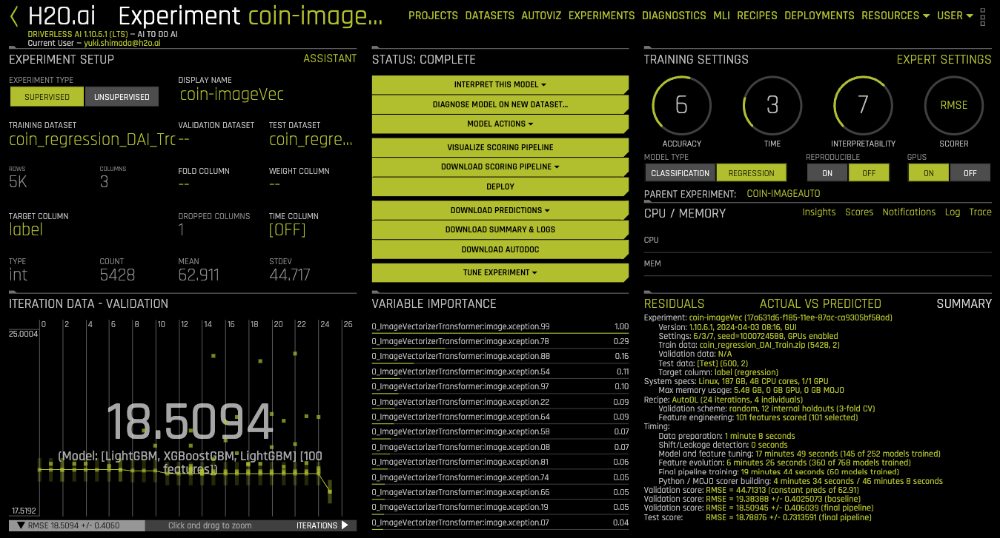

## Driverless AI

Dataset: 
 - (Train) https://sample-data-open.s3.ap-northeast-1.amazonaws.com/brazilian_coins/coin_regression_DAI_Train.zip
- (Test) https://sample-data-open.s3.ap-northeast-1.amazonaws.com/brazilian_coins/coin_regression_DAI_Test.zip

***
### Auto Image Model

| Metric   | Test Data Score |
|----------|------------|
| RMSE     | 1.380756   |
| GINI     | 0.9998794  |
| MAE      | 0.8594596  |
| MAPE     | 1.916375   |
| MER      | 1.038075   |
| MSE      | 1.906488   |
| R2COD    | 0.9990561  |
| R2       | 0.9991063  |
| RMSLE    | 0.03135071 |
| RMSPE    | 3.722372   |
| SMAPE    | 1.894473   |

***
### Image Vectorizer

| Metric                     | Validation Data Score | Test Data Score |
|----------------------------|-----------------------|-------------------|
| RMSE                       | 18.50945              | 18.78876          |
| GINI                       | 0.9181366             | 0.9159234         |
| MAE                        | 13.50919              | 13.8017           |
| MAPE                       | 46.60642              | 49.25906          |
| MER                        | 19.77438              | 18.94847          |
| MSE                        | 342.8669              | 353.0175          |
| R2COD                      | 0.8282468             | 0.8252212         |
| R2                         | 0.8286305             | 0.8253499         |
| RMSLE                      | 0.4770904             | 0.4963619         |
| RMSPE                      | 104.0748              | 106.9273          |
| SMAPE                      | 31.49299              | 33.01589          |

