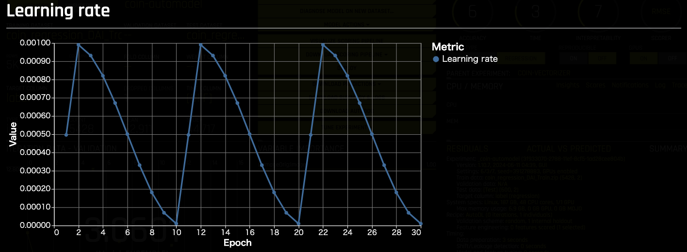

## Driverless AI

Document:
- [Image Processing in Driverless AI](https://docs.h2o.ai/driverless-ai/1-10-lts/docs/userguide/image-processing.html)
  
Dataset: 
 - (Train) https://sample-data-open.s3.ap-northeast-1.amazonaws.com/brazilian_coins/coin_regression_DAI_Train.zip
 - (Test) https://sample-data-open.s3.ap-northeast-1.amazonaws.com/brazilian_coins/coin_regression_DAI_Test.zip

***
### 結果
結果： [Results_DAI.xlsx](./Results_DAI.xlsx)

| Metric   | Vectorizer (特徴量抽出器) - Validation Data Score | Vectorizer (特徴量抽出器) - Test Data Score | Vectorizer (Fine Tuning) - Validation Data Score | Vectorizer (Fine Tuning) - Test Data Score | Auto Model - Test Data Score |
|----------|--------------------------------------------------|-------------------------------------------|------------------------------------------------|-----------------------------------------|-----------------------------|
| RMSE     | 18.59666                                         | 18.44361                                  | 8.750941                                       | 8.046021                                | 1.738882                     |
| GINI     | 0.9180614                                        | 0.917659                                  | 0.9789442                                      | 0.9828845                               | 0.9994783                    |
| MAE      | 13.53451                                         | 13.48838                                  | 6.743863                                       | 6.141971                                | 0.7522005                    |
| MAPE     | 46.8538                                          | 47.45527                                  | 39.17866                                       | 37.52863                                | 2.181362                     |
| MER      | 19.16716                                         | 19.05152                                  | 9.717235                                       | 8.144005                                | 1.125                        |
| MSE      | 346.1138                                         | 340.1668                                  | 76.64074                                       | 64.73846                                | 3.02371                      |
| R2COD    | 0.8269788                                        | 0.8315835                                  | 0.9616312                                      | 0.967948                                | 0.998503                     |
| R2       | 0.8274195                                        | 0.8317417                                  | 0.9624218                                      | 0.9695657                               | 0.998519                     |
| RMSLE    | 0.480494                                         | 0.4869634                                  | 0.4105091                                      | 0.4004319                               | 0.05885839                   |
| RMSPE    | 102.9075                                         | 104.0343                                  | 78.5012                                       | 75.87303                                | 4.940664                     |
| SMAPE    | 31.38323                                         | 31.91913                                  | 25.65782                                       | 24.45533                                | 2.188541                     |

***
### Auto Image Model
学習時間: 4時間20分

***
### Image Vectorizer (特徴量抽出器)
学習時間: 1時間24分

  
***
### Image Vectorizer (Fine Tuning)
学習時間: 5時間4分

