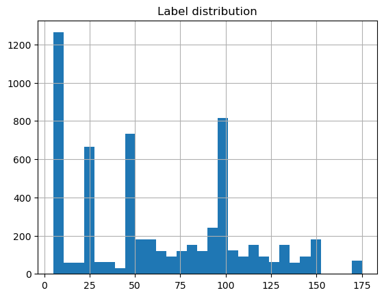

# Regression

Original Source: https://www.kaggle.com/datasets/lgmoneda/br-coins
  
ブラジル貨幣の予測
 - 画像サイズ（全て同じ）： (H, W, C) = (480, 640, 3)
 - 学習データ数：5428、テストデータ数:600、合計:6028
  
***

 - Driverless AIによる実施: [DAI dir](./DAI)
 - Hydrogen Torchによる実施: [HT dir](./HT)
   
***

[EDA](./EDA.ipynb)  
  
  

