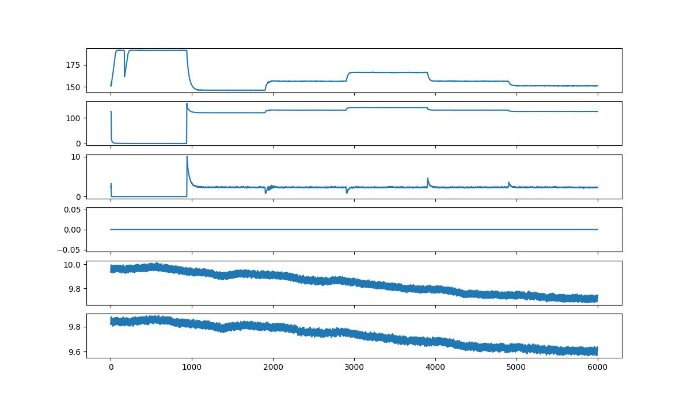
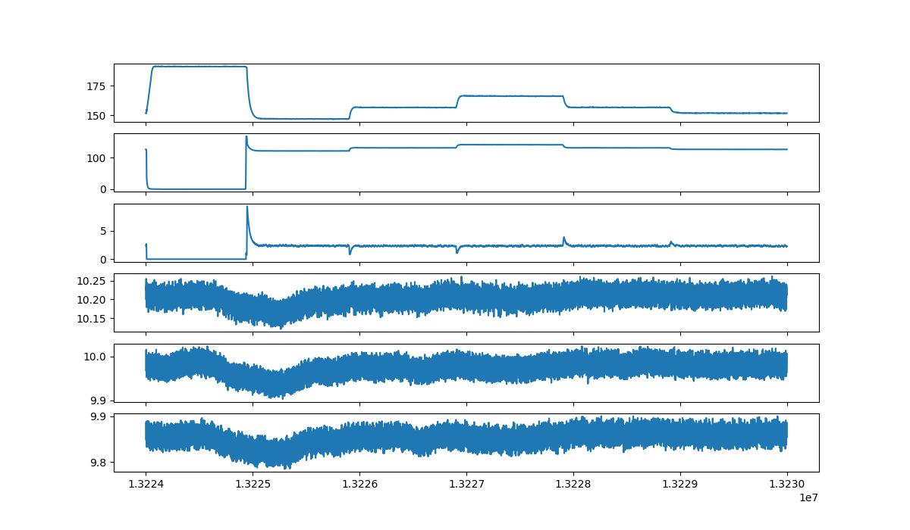

## 画像（時系列プロット）分類（CNN）
各種センサーデータを時系列プロットし保存。それら波型の画像の分類問題として処理（Image Data Classification by Convolutional Neural Network）

***
### Data加工
[make_images.ipynb](./make_images.ipynb)
- 各センサーの縦積みデータ（features.pickle）から、matplotlibによる時系列プロットを作成、保存（2205枚）
    - 時系列プロットは６センサーのみ（PS1, PS2, PS3, PS4, PS5, PS6）。６行の縦積みプロット

[make_data_for_HT.ipynb](./make_data_for_HT.ipynb)
- ラベルデータ（profile_with_testflag.csv）から、学習データ（SensorWave/train.csv）とテストデータ（SensorWave/test.csv）を作成
    - SensorWave/train.csv: (1905, 2)
    - SensorWave/test.csv: (300, 2)

2205枚の画像は、手動でSensorWaveディレクトリ内のimageディレクトリに移動

**Download**
- SensorWave.zip: https://sample-data-open.s3.ap-northeast-1.amazonaws.com/SensorClassification_ConditionMonitoringHydraulicSystems/SensorWave.zip

***
### 画像サンプル
0.jpg, Stable_flag=1  

2204.jpg, Stable_flag=0  

上からPS1, PS2, PS3, PS4, PS5, PS6

***
### 結果

複数のアーキテクチャ(eca_nfnet_l0, resnet50, tf_efficientnetv2_b3)といくつかのデータ拡張で実験
| Ranking | Experiment Name                                                                                                   | backbone            | learning rate | augmentations strategy | mix image | ROC_AUC Valid | ROC_AUC Test | Runtime |
|---------|-------------------------------------------------------------------------------------------------------------------|----------------------|---------------|------------------------|-----------|---------------|--------------|---------|
| 1       | SensorWave-rd1_augmentations_strategy_Soft_backbone_tf_efficientnetv2_b3_learning_rate_0.001_mix_image_Disabled    | tf_efficientnetv2_b3 | 0.001         | Soft                  | Disabled  | 0.9935        | 0.9903       | 0:01:20 |
| 2       | SensorWave-rd1_augmentations_strategy_Soft_backbone_tf_efficientnetv2_b3_learning_rate_0.0003_mix_image_Disabled   | tf_efficientnetv2_b3 | 0.0003        | Soft                  | Disabled  | 0.9965        | 0.9889       | 0:01:20 |
| 3       | SensorWave-rd1_augmentations_strategy_Soft_backbone_tf_efficientnetv2_b3_learning_rate_0.0001_mix_image_Disabled   | tf_efficientnetv2_b3 | 0.0001        | Soft                  | Disabled  | 0.9957        | 0.9863       | 0:01:17 |
| 4       | SensorWave-rd1_augmentations_strategy_Soft_backbone_tf_efficientnetv2_b3_learning_rate_0.001_mix_image_Mixup       | tf_efficientnetv2_b3 | 0.001         | Soft                  | Mixup     | 0.9883        | 0.9862       | 0:01:20 |
| 5       | SensorWave-rd1_augmentations_strategy_Soft_backbone_tf_efficientnetv2_b3_learning_rate_0.0001_mix_image_Mixup      | tf_efficientnetv2_b3 | 0.0001        | Soft                  | Mixup     | 0.9904        | 0.9858       | 0:01:19 |
| 6       | SensorWave-rd1_augmentations_strategy_Soft_backbone_tf_efficientnetv2_b3_learning_rate_0.0003_mix_image_Mixup      | tf_efficientnetv2_b3 | 0.0003        | Soft                  | Mixup     | 0.9898        | 0.9857       | 0:01:20 |
| 7       | SensorWave-rd1_augmentations_strategy_Soft_backbone_resnet50_learning_rate_0.0001_mix_image_Disabled               | resnet50             | 0.0001        | Soft                  | Disabled  | 0.9904        | 0.9854       | 0:01:13 |
| 8       | SensorWave-rd1_augmentations_strategy_Soft_backbone_resnet50_learning_rate_0.001_mix_image_Disabled                | resnet50             | 0.001         | Soft                  | Disabled  | 0.9919        | 0.9844       | 0:01:10 |
| 9       | SensorWave-rd1_augmentations_strategy_Soft_backbone_resnet50_learning_rate_0.001_mix_image_Mixup                   | resnet50             | 0.001         | Soft                  | Mixup     | 0.9889        | 0.9832       | 0:01:13 |
| 10      | SensorWave-rd1_augmentations_strategy_Medium_backbone_tf_efficientnetv2_b3_learning_rate_0.0003_mix_image_Disabled | tf_efficientnetv2_b3 | 0.0003        | Medium                | Disabled  | 0.9911        | 0.9827       | 0:01:20 |
