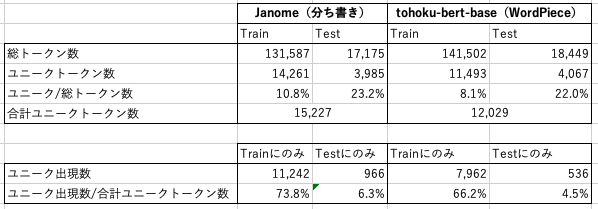

## TFIDF
DriverlessAI Text Vectorizationアプローチ（テキストにトークン化を実施。そのトークン化テキストのみを用いDriverlessAIデフォルト設定で予測を実施（TFIDFが適用され、正則化回帰や、次元削減が行われる））。  
ドキュメント: https://docs.h2o.ai/driverless-ai/1-10-lts/docs/userguide/nlp.html

***
### Experiments Result
- トークン化をJanome（単語単位の形態素解析）とtohoku-nlp/bert-base-japanese-whole-word-masking（WordPiece）の２種類で実施。各5回同じ設定でExperimentを作成し、精度を検証
  
| Experiment Name                  | Tokenizer          | F1 - Validation | F1 - Test | Time   |
|----------------------------------|--------------------|-----------------|-----------|--------|
| 1.hatespeech_vec_janome            | Janome             | 0.539           | 0.457     | 0:20:36|
| 2.hatespeech_vec_janome            | Janome             | 0.586           | 0.557     | 0:23:39|
| 3.hatespeech_vec_janome            | Janome             | 0.52            | 0.505     | 0:06:57|
| 4.hatespeech_vec_janome            | Janome             | 0.55            | 0.491     | 0:09:31|
| 5.hatespeech_vec_janome            | Janome             | 0.562           | 0.5       | 0:11:12|
| 1.hatespeech_vec_tohokuBertBase    | tohoku-Bert-Base   | 0.576           | 0.551     | 0:21:57|
| 2.hatespeech_vec_tohokuBertBase    | tohoku-Bert-Base   | 0.572           | 0.588     | 0:30:00|
| 3.hatespeech_vec_tohokuBertBase    | tohoku-Bert-Base   | 0.577           | 0.528     | 0:16:29|
| 4.hatespeech_vec_tohokuBertBase    | tohoku-Bert-Base   | 0.569           | 0.597     | 0:18:42|
| 5.hatespeech_vec_tohokuBertBase    | tohoku-Bert-Base   | 0.589           | 0.567     | 0:12:09|
  
hatespeech_vec_janomeの平均(F1 - Test): 0.502  
hatespeech_vec_tohokuBertBase平均(F1 - Test): 0.5662  
(t-test p-value=0.0136  ->  hatespeech_vec_tohokuBertBaseの方が有意に精度が高い)

***
### Tokenizerの影響

- WordPiece(BERT)の方が、形態素解析に対して細かく分割される
- 結果、WordPieceはユニークトークンにすると少なくなる
- WordPieceの方が、片方のデータのみに出現するトークンが少ない（テストデータに出現する、学習データになかった単語の出現を抑えることができる）

  
